# 从 0 到 1，带你提交第一个 Agent Infra 赛事作品

**赛事官网：** [https://www.goaihz.com/tracks?track=infra&channel=dw6](https://www.goaihz.com/tracks?track=infra&channel=dw6)[**https://www.goaihz.com/tracks?track=infra&channel=dw6**](https://www.goaihz.com/tracks?track=infra&channel=dw6)

> 📌 这条赛道不是要求你做一个“什么都会一点”的聊天机器人，而是要求多个不同职责的 Agent 一起解决一个真实、复杂的问题。
> 
> 最核心的要求可以记成：
> 
> 1. 必须以 **AgentTeams** 作为多 Agent 协同的基础；
> 2. 至少设计 **3 个不同职能的 Agent** ；
> 3. 必须设计能够复用的 **Skill** ；
> 

## 一、一起动手操作吧！！

## 步骤一：准备一台不用自己配置的云电脑

### 1. 创建腾讯云 Cloud Studio 环境

部署 AgentTeams 需要使用 Docker 等工具，本地安装和配置对零基础学习者有一定门槛。为降低环境配置难度，本教程统一使用已预装开发环境的腾讯云 Cloud Studio。

#### 1.1 登录 Cloud Studio，并创建应用

打开：[腾讯云 Cloud Studio](https://cloudstudio.net/)，按照页面提示登录。

登录后，在页面右上角点击“创建应用”。模板选择 **All in One** ，然后点击“创建”。

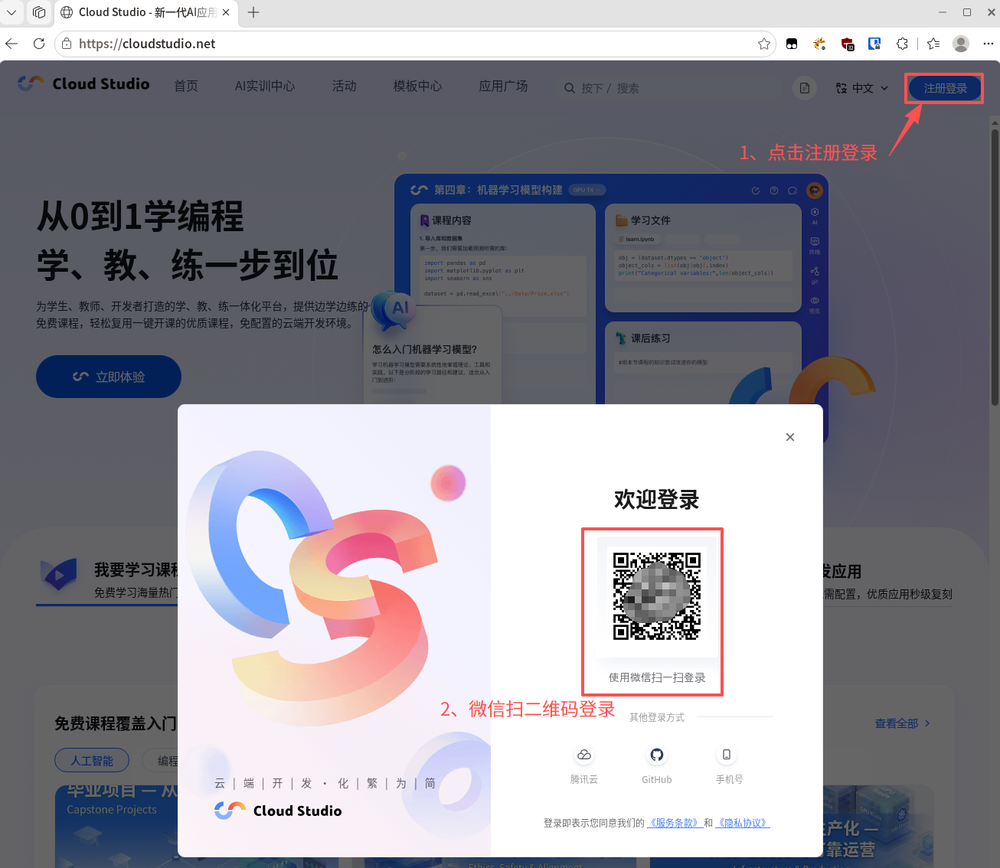

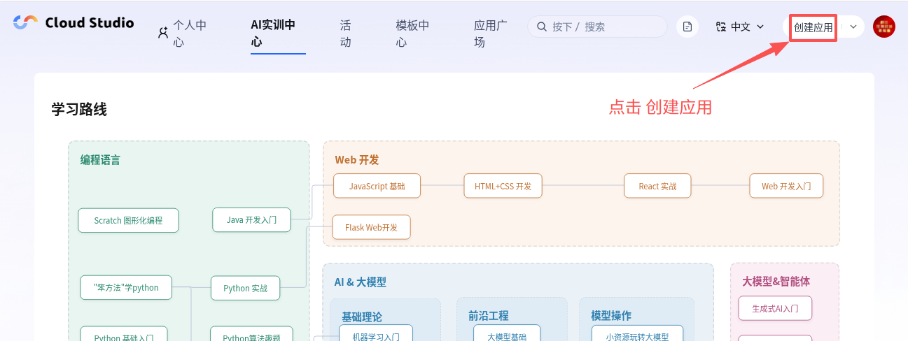

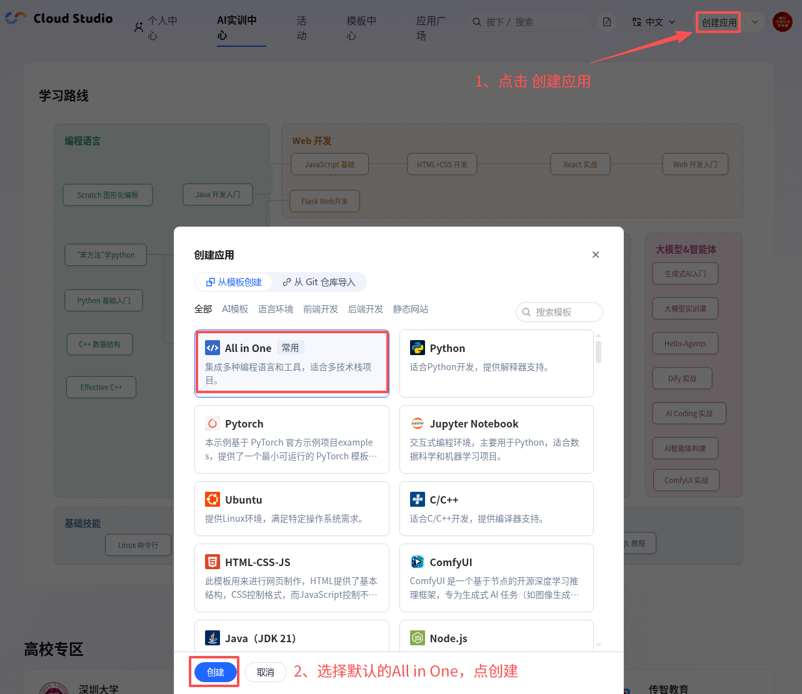

#### 1.2 检查机器配置 & AI 的使用

进入云环境后，看页面右上角的机器配置。如果不是 4 核 8 GB，点击配置区域的“切换”，换成 4 核 8 GB。

> 本教程使用：CPU：4 核内存：8 GB

在左侧有一个“ **⚡️** ”的按钮，点开可以使用AI来帮助处理问题。

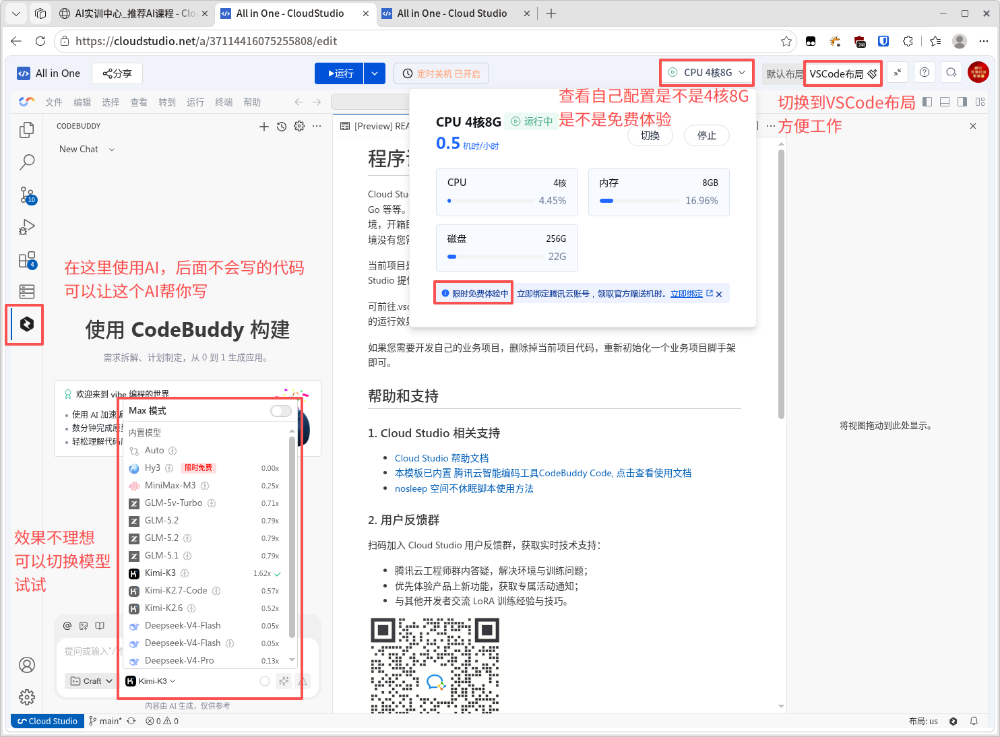

### 2. 配置自动关机

Cloud Studio并不一定会自动关闭。为了避免忘记关闭导致的费用超支， **建议设置定时关机** 。从0开始完整运行一次Demo的时间，预期是1小时，推荐设置2或4小时后关机。

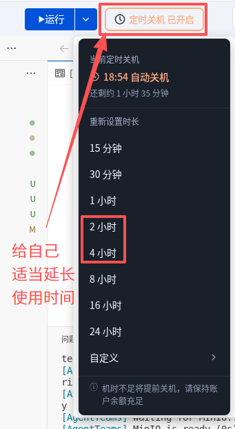

> 云环境关闭后，程序也会停止。需重新打开云环境使用。

## 步骤二：准备大模型 API Key

获取 DeepSeek API Key：AgentTeams 自己不是大模型，它需要通过 API 调用大模型。本教程使用 DeepSeek。

### 1. 登录

打开：[DeepSeek 开放平台](https://platform.deepseek.com)，按页面提示使用手机号、验证码或微信扫码登录。

### 2. 检查余额并进入 API Keys

进入控制台后，打开“API Keys”。如果账户余额不足，需要按自己的需要少量充值。跑一次demo做需要的消耗在1元以内，可以充个5元试试。

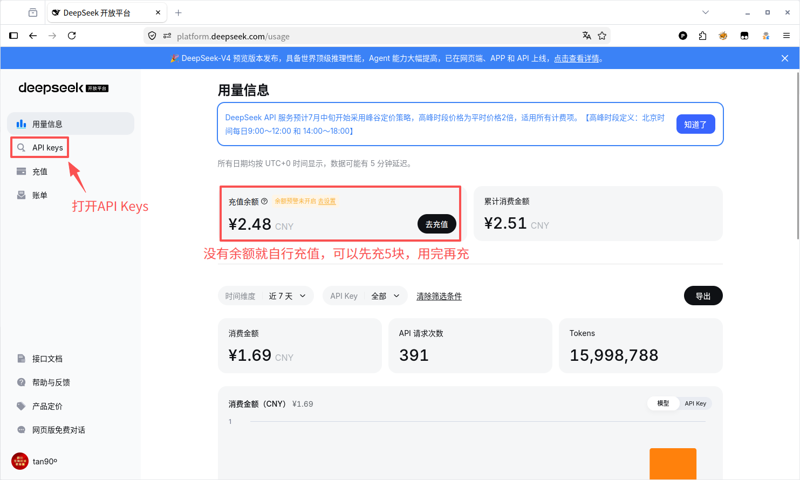

### 3. 创建 API Key

（1）点击“创建 API Key”，名称只是个备注，可以任意填写。

（2）接下来会得到一个 API Key，请暂时不要关闭这个页面，后面安装 AgentTeams 时需要粘贴。

> API Key 相当于调用大模型的密码。请不要把自己的 Key 发到聊天群、GitHub Issue 或公开文档中。

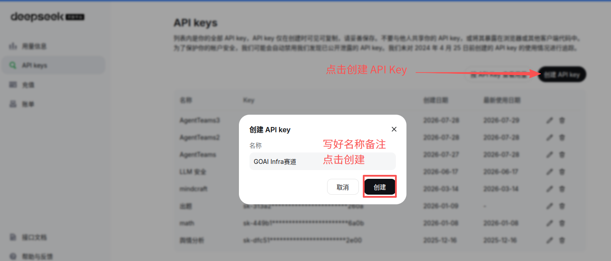

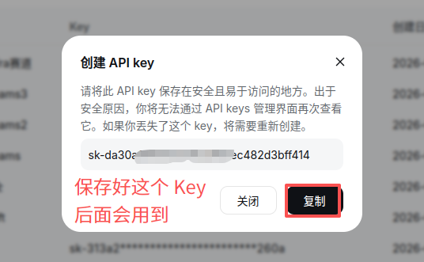

## 步骤三：安装 AgentTeams（大概 10 min）

### 1. 认识终端并运行官方安装命令

在 Cloud Studio 页面中切换到 VSCode 布局。点击顶部菜单：

```
终端 → 新建终端
```

页面底部会出现一个可以输入命令的区域。如果终端前面显示类似：

```
/workspace git:(main)
```

说明终端已经可以使用。把下面整行命令复制到终端，按回车：

```
bash <(curl -sSL https://raw.githubusercontent.com/agentscope-ai/AgentTeams/main/install/agentteams-install.sh)
```

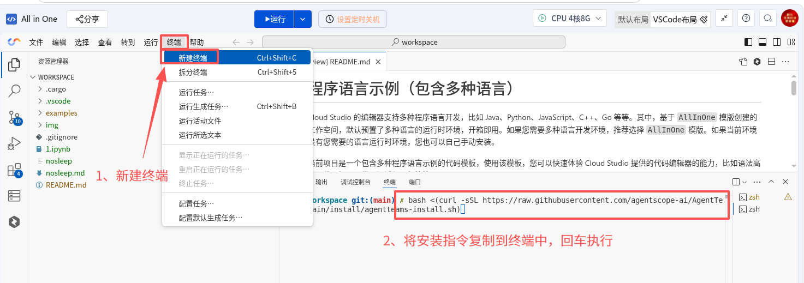

安装过程中会出现多个问题。你需要使用键盘输入答案，再按回车。

#### 1.1 安装选项怎么填

安装器版本更新后，选项顺序或默认文字可能略有变化。请优先看选项名称，不要只死记序号。

**安装器询问的内容**

**本教程选择**

语言

使用默认值中文

安装模式

使用默认值快速开始

版本

选择默认的 latest

LLM 供应商

选择“OpenAI 兼容 API”

Base URL

https://api.deepseek.com/v1

默认模型 ID

deepseek-v4-flash

最大上下文长度

1000000

最大输出长度

384000

是否支持推理/思考模式

Y

是否支持图片输入

N

LLM API Key

粘贴前面复制的 DeepSeek API Key

记忆搜索配置

选择 3，即不启用

Manager 运行时

选择 QwenPaw（又名CoPaw）

Worker 运行时

选择 QwenPaw（又名CoPaw）

其他没有特别说明的选项

保持默认值，直接回车

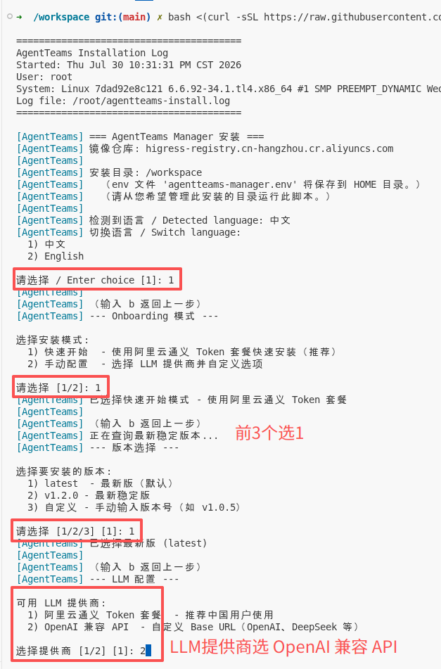

选择 Agent 运行时的时候，本教程统一选择 QwenPaw（也叫CoPaw）。

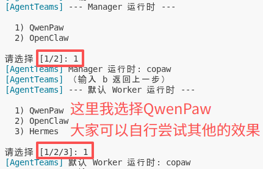

#### 1.2 怎样判断安装成功

安装过程中，会看到类似这样的文字

```
0eb785b168ec: Pulling fs layer
43272e9c9d4b: Waiting
a3629ac5b9f4: Verifying Checksum
a3629ac5b9f4: Download complete
```

这个是在下载运行AgentTeams所需的镜像，没有下载进度条，请耐心等待几分钟。

安装完成后，终端会显示：

> AgentTeams 已启动；Element 或聊天页面地址；管理员用户名；自动生成的管理员密码。

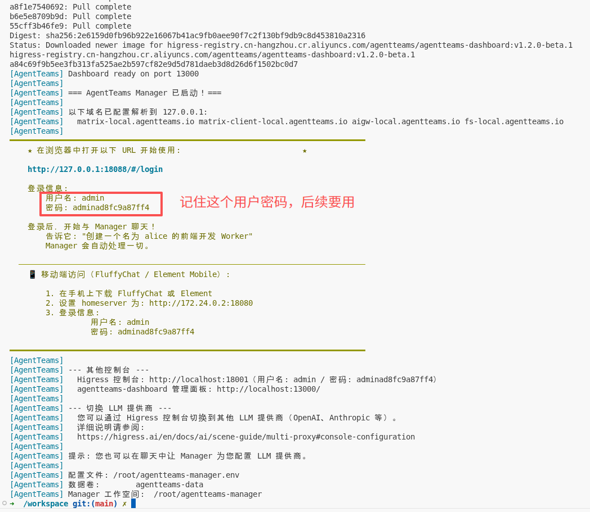

#### 1.3 忘记密码怎么办

用户名固定使用：

```
admin
```

如果忘记管理员密码，在终端执行：

```
grep '^AGENTTEAMS_ADMIN_PASSWORD=' /root/agentteams-manager.env
```

你会看到类似：

```
AGENTTEAMS_ADMIN_PASSWORD=这里是你自己的密码
```

只复制等号右边的内容。

### 2. 打开 Element 聊天界面

#### 2.1 找到 18088 端口

在 Cloud Studio 底部面板中点击“端口”，找到 `18088` ，点击这一行右侧的打开网页图标。

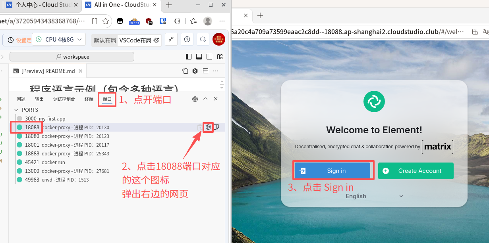

#### 2.2 设置 Homeserver

Element 打开后，点击“Sign in”。

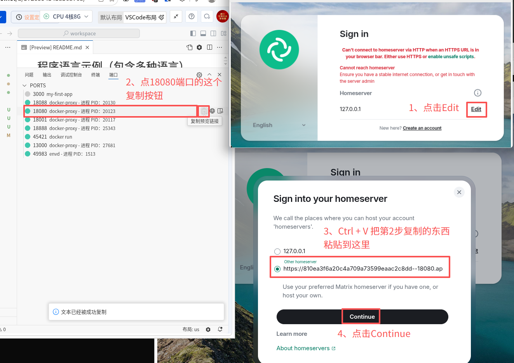

如果页面要求填写 Homeserver：

> （1）点击 `Edit` ；（2）回到 Cloud Studio 的端口列表；（3）复制 `18080` 端口对应的公开访问地址；（4）粘贴到 Homeserver；（5）点击 `Continue` 。

#### 2.3 登录

填写：

- Username： `admin`
- Password：安装完成时显示的密码

然后点击 `Sign in` 。

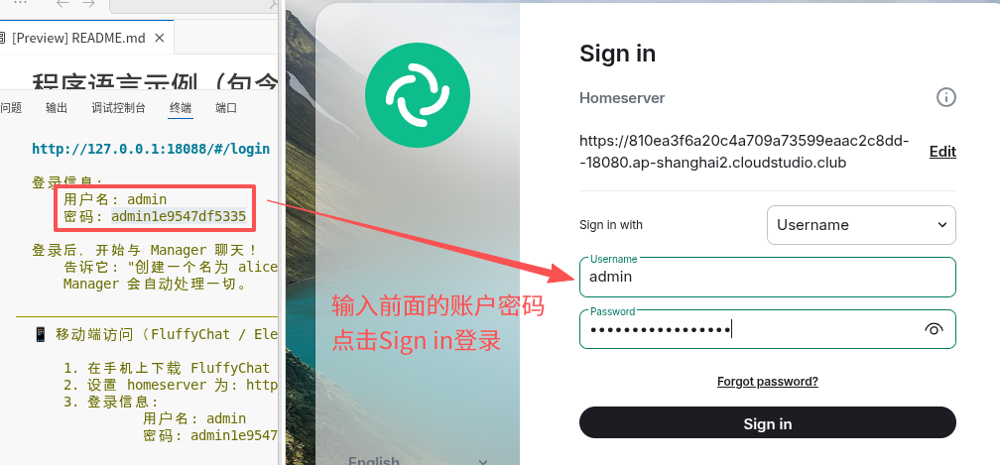

#### 2.4 测试运行

左侧找到并打开： `Manager: default`

可以发送一些文字来测试能否正常对话，若是能正常对话，则说明AgentTeams安装成功了。

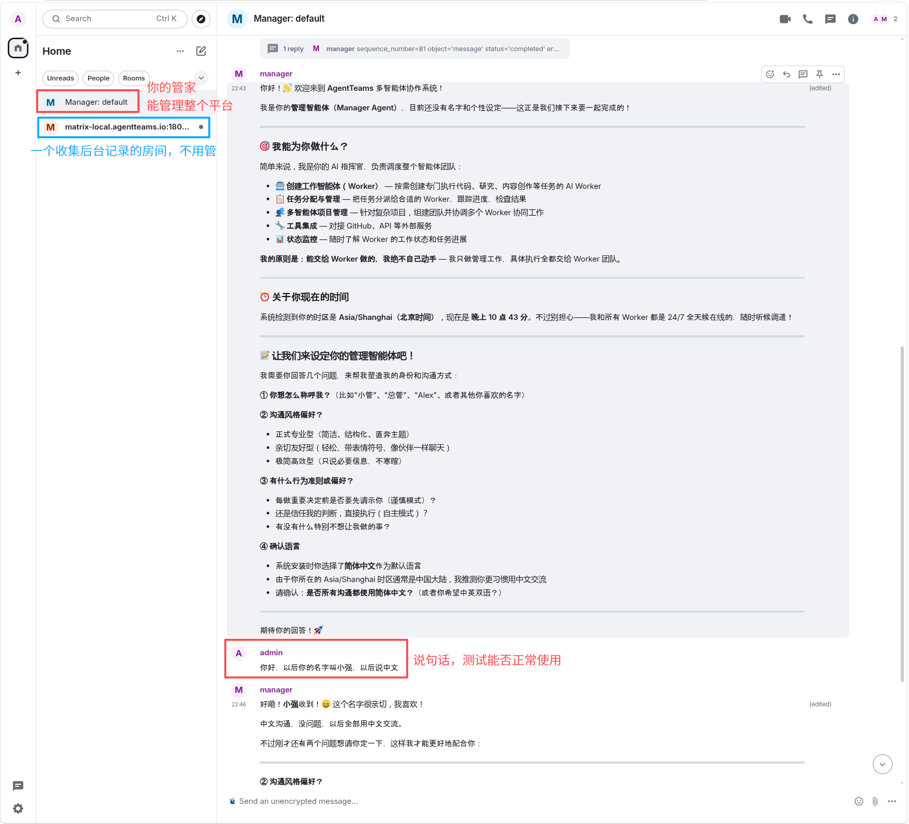

## 步骤四：安装并了解赛题官方demo

赛事方提供了一个赛题DEMO，我们将其跑通测试下。

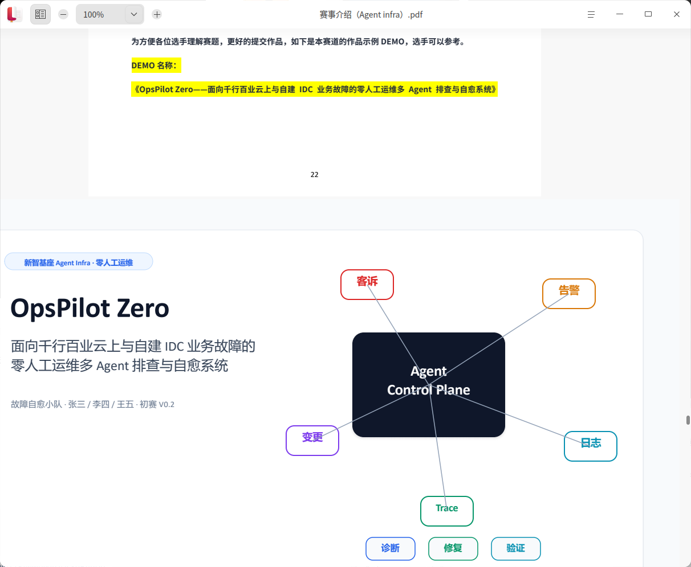

下载官方demo作品的 .zip 包，解压出文件夹，拖拽到 Cloud Studio 左侧的文件区域。

opspilot-zero-demo.zip
57.61KB
- 
- 

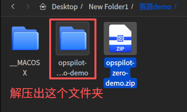

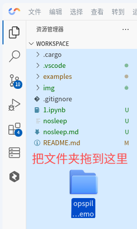

上传完成后，左侧文件区域最终应该看到文件夹：

```
opspilot-zero-demo
```

展开文件夹，找到并打开 `opspilot-zero-demo/README.md`

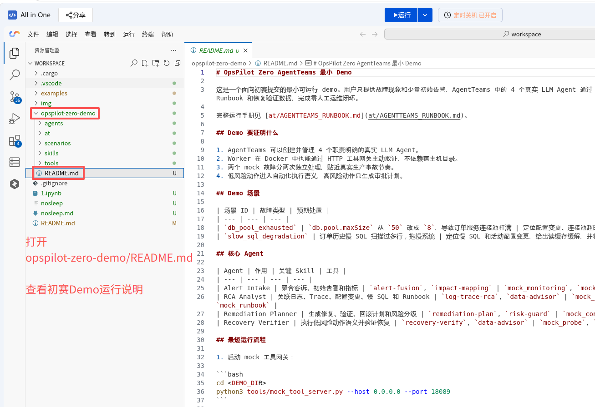

这份 README 是完整的DEMO运行说明。本教程已经把其中需要执行的部分按小白操作顺序整理好了。

### 1. 启动 Mock 工具服务

你可以把这个 Mock 工具服务理解成一台 **提前设置好故障的模拟业务服务器** 。它准备了“订单创建失败”和“订单历史页变慢”等故障场景。AgentTeams 会查询相关数据、分析根因、执行允许的模拟修复，并验证业务是否恢复。

启动这个服务后，AgentTeams 会像处理真实服务器故障一样，主动查询这些数据、寻找故障原因、制定并执行允许的模拟修复，最后检查业务是否恢复。这个 Demo 展示的是一套完整的“发现故障—分析根因—修复故障—验证恢复”流程，但不会改动任何真实生产服务器。

#### 1.1 新建一个终端

点击： `终端 → 新建终端`

#### 1.2 运行Mock服务

在新终端中执行：

```
cd /workspace/opspilot-zero-demo
python3 tools/mock_tool_server.py --host 0.0.0.0 --port 18089
```

如果成功，会看到：

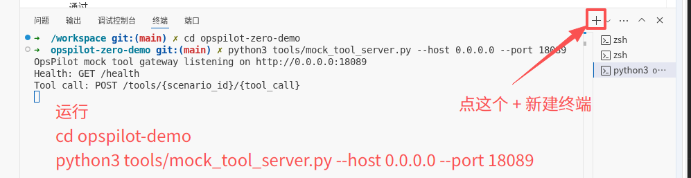

#### 1.3 这个终端不要关闭

只要 Demo 还没有跑完，就让这个终端保持运行。

不要在这个终端继续输入别的命令。需要执行其他命令时，点击终端右上角的 `+` ，再开一个新终端。

#### 可选：检查 Mock 服务

在另一个终端执行：

```
curl http://127.0.0.1:18089/health
```

如果看到包含下面内容的结果，表示服务正常：

```
{
  "ok": true,
  "service": "opspilot-mock-tool-gateway"
}
```

### 2. 把 Mock 地址替换成统一地址

打开文件：

```
opspilot-zero-demo/at/create_agents_messages.md
```

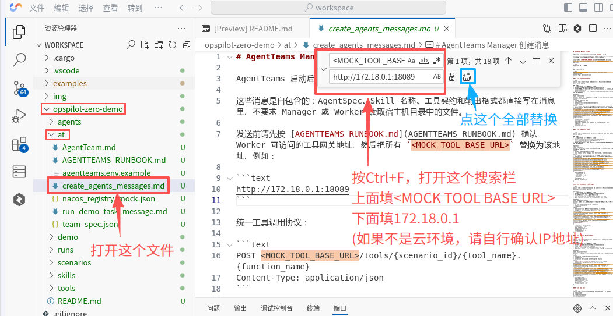

按 `Ctrl + F` 打开“查找和替换”。

查找： `<MOCK_TOOL_BASE_URL>`

替换为： `http://172.18.0.1:18089`

> 使用其他环境，如本地电脑时，请按 Demo 的 `README.md` 确认地址。

点击“全部替换”。

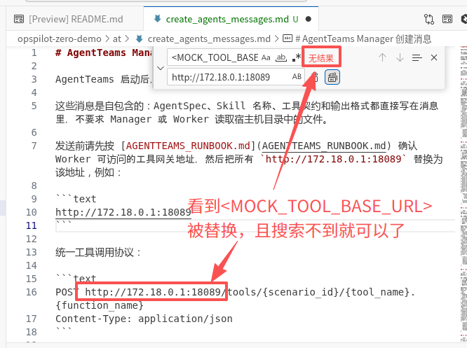

替换后，文件里的工具地址应该类似：

```
POST http://172.18.0.1:18089/tools/{scenario_id}/{tool_name}.{function_name}
```

## 步骤五：创建 4 个 Agent 和 1 个 Team（大概 5 min）

### 1. 复制创建 Agent 和 Team 的消息

Manager 是管理整个 AgentTeams 的“最终 Boss”，负责接收你的管理指令、创建 Agent 组织团队。

Demo 已经把创建 4 个 Worker 和 1 个 Team 所需的内容写在同一个代码框里。你只需要把这个代码框复制一次，然后发送给 Manager 即可自动“安装”。

打开：

```
opspilot-zero-demo/at/create_agents_messages.md
```

在文件中复制这个大标题下面的 **全部内容** ：

```
## 复制到 Manager 的完整创建请求
```

### 2. 把完整创建请求发送给 Manager

回到 Element，打开： `Manager: default` ，把刚才代码框中的全部内容粘贴到 Manager 房间，发送一次即可。

> Manager 按下面的顺序执行：（1）创建 `alert-intake` ；（2）确认它创建成功并可以运行；（3）创建 `rca-analyst` ；（4）创建 `remediation-planner` ；（5）创建 `recovery-verifier` ；（6）确认 4 个 Worker 都可以运行；（7）最后创建 `opspilot-zero-demo` Team。

这些步骤由 Manager 自动依次完成。你不需要再次手动复制每个 Worker 的创建内容，也不要重复发送完整请求。

创建过程可能需要一些时间。Worker 创建后，会在 AgentTeams 界面中出现对应条目。创建成功后，再按如下操作。

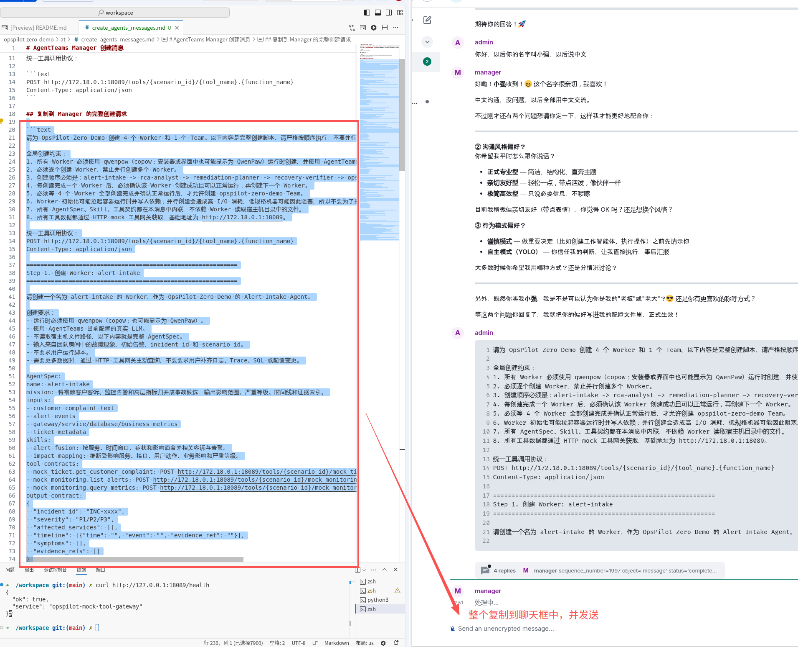

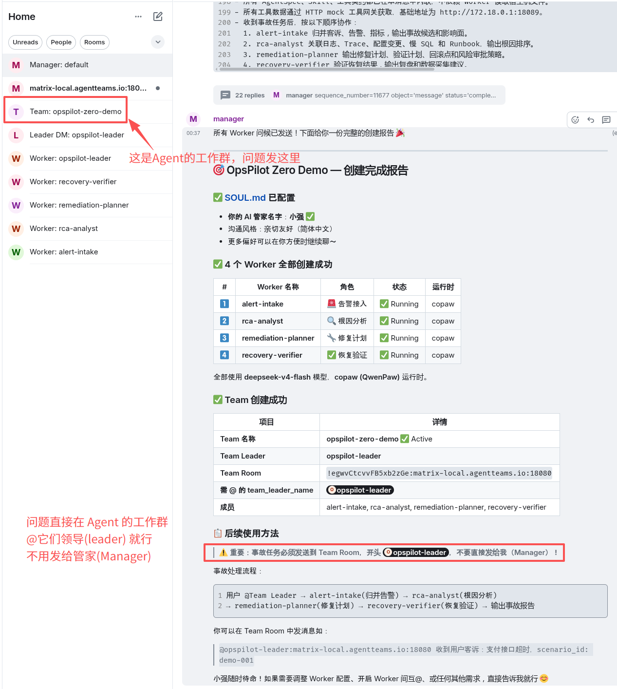

## 步骤六：运行两次事故处理任务（大概 30 min）

4 个 Worker 和 `opspilot-zero-demo` Team 创建完成后，在 Element Web/Matrix 会话列表中找到名称以 `Team` 开头、对应 `opspilot-zero-demo` 的 Team 房间。

打开 `opspilot-zero-demo/at/create_agents_messages.md` ，把订单创建失败的事故任务处置任务复制好。

进入 Team 房间后，在输入框先输入并选中 `@<team_leader_name>` ，再把事故任务复制到这条 @ 消息里发送。不要把事故任务发给 `manager` 。 `manager` 用于创建和管理 Agent/Team；Team 房间中的 leader 用于接收业务任务并调度 Worker。

请逐个任务发送：先发送第一起事故，等 `INC-1001` 事故报告完整输出后，再发送第二起事故。不要同时发送两条事故任务，避免 Team 并发调度时上下文和工具状态互相干扰。

每条消息只包含用户能自然提供的故障现象和少量初始告警。

Agent 会通过工具网关主动查询日志、Trace、配置变更、慢 SQL、Runbook、恢复指标等信息，完成任务。

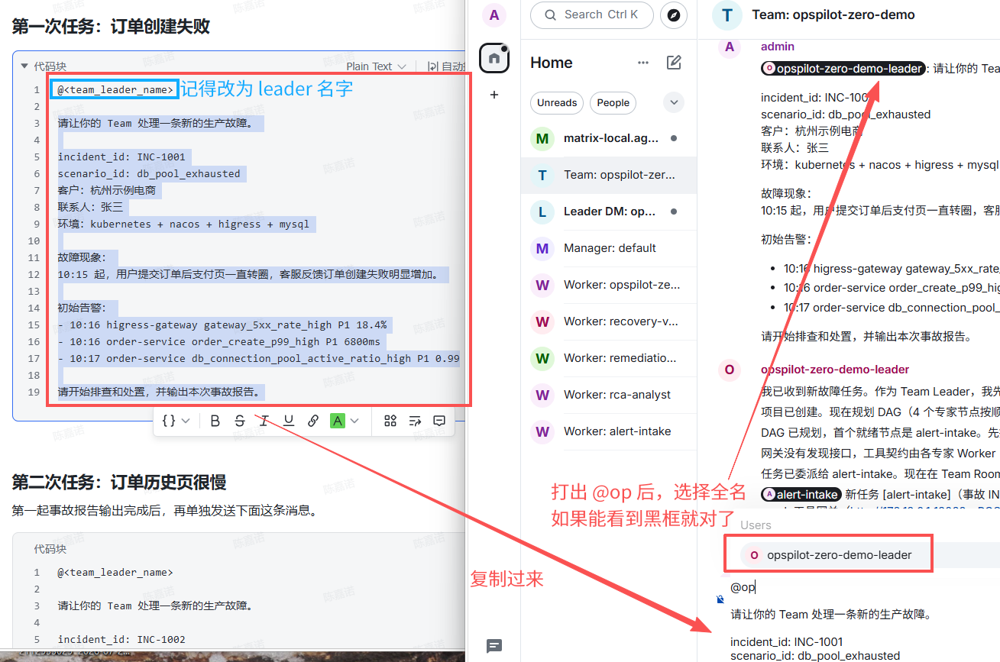

接下来就可以看到它的报告了

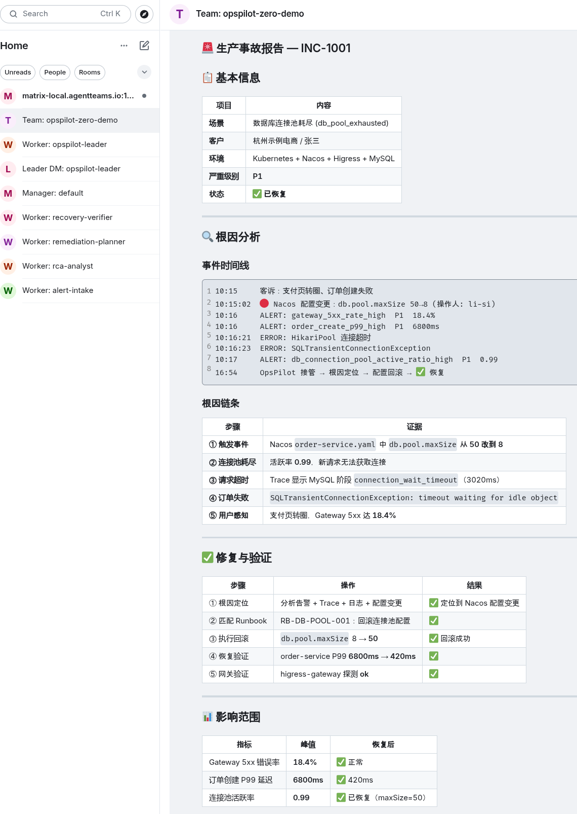

### 第一次任务：订单创建失败

```
@<team_leader_name>

请让你的 Team 处理一条新的生产故障。

incident_id: INC-1001
scenario_id: db_pool_exhausted
客户：杭州示例电商
联系人：张三
环境：kubernetes + nacos + higress + mysql

故障现象：
10:15 起，用户提交订单后支付页一直转圈，客服反馈订单创建失败明显增加。

初始告警：
- 10:16 higress-gateway gateway_5xx_rate_high P1 18.4%
- 10:16 order-service order_create_p99_high P1 6800ms
- 10:17 order-service db_connection_pool_active_ratio_high P1 0.99

请开始排查和处置，并输出本次事故报告。
```

### 第二次任务：订单历史页很慢

第一起事故报告输出完成后，再单独发送下面这条消息。

```
@<team_leader_name>

请让你的 Team 处理一条新的生产故障。

incident_id: INC-1002
scenario_id: slow_sql_degradation
客户：上海示例零售
联系人：李四
环境：kubernetes + nacos + ingress + mysql

故障现象：
14:05 起，午间活动后订单历史页打开很慢；用户仍可下单，但客服投诉明显增多。

初始告警：
- 14:06 order-service order_history_p99_high P2 9200ms
- 14:07 mysql mysql_cpu_high P2 88%
- 14:08 mysql slow_sql_count_high P2 142 queries/min

请开始排查和处置，并输出本次事故报告。
```

## 步骤七：思考自己的使用场景，并了解AgentTeams的能力

AgentTeams 可以让多个 OpenClaw 协同完成任务，并为不同 Agent 设置明确分工。

OpenClaw 能实现的大部分能力，都可以迁移到 AgentTeams 中，并通过多角色协作进一步拆解复杂任务。

因此，在使用 AgentTeams 时，可以参考现有的 OpenClaw 教程、工具和案例。

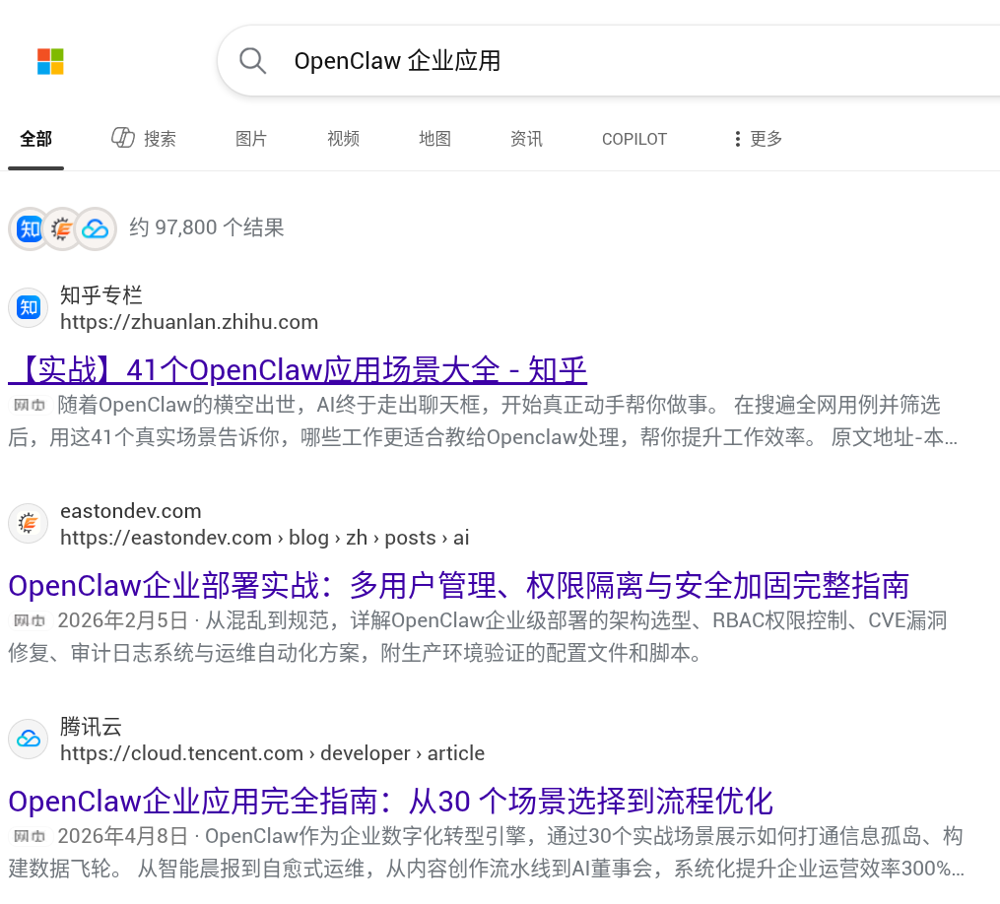

### 云环境机时不够用怎么办？

如果免费机时用完了，就会提醒你绑定腾讯云账户，领取20机时（可以用40小时），此外每天可以领取2机时（可以用4小时）

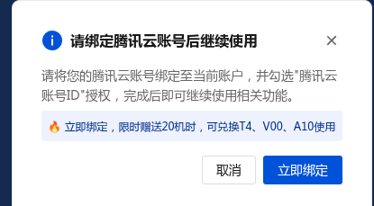

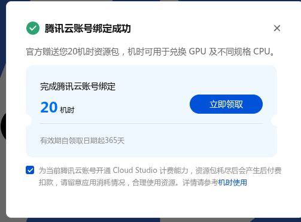

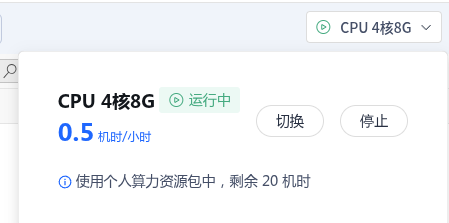

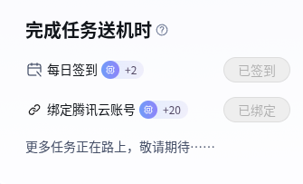

如果免费领取的机时不够用，可以购买资源包，按4核8G的云电脑规格，1块钱可以用2小时。

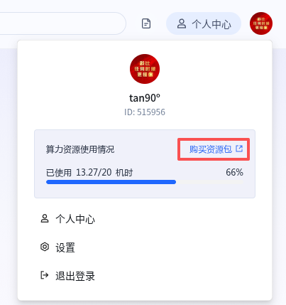

## 步骤八：完成**方向与方案设计**

### **1. 下载初赛作品提交模板**

直接点击如下文件下载

Agent Infra初赛方案PPT框架模板.pptx
2.09MB
- 
- 

### 2. 按PPT模板，结合你的作品方向与方案，补充如下材料

#### 2.1 作品简介

**500 字以内** ，建议包含：项目名称、解决的真实问题、目标用户或行业、核心方案、创新点、哪些能力可以开放或复用、当前已经完成到什么程度。

#### 2.2 方案 PPT

建议包含：

（1）场景背景和实际价值；

（2）不少于 3 个 Agent 的职责与协作关系；

（3）AgentTeams 如何完成编排、任务拆解、上下文传递和状态管理；

（4）核心 Skill 的输入、输出、依赖、失败处理和复用价值；

（5）工具、MCP、RAG 或其他系统的接入方式；

（6）结果验证、审批、回滚、安全和审计；

（7）后续做成可运行 Demo 的计划。

#### 2.3 团队介绍

记得需要在PPT里补充团队介绍喔～

初赛不强制提交可运行代码。把本教程中的 Baseline 跑通，帮助你 **理解多 Agent 是怎样协作的** 。

## 步骤九：提交赛事作品到官网

1. **将生成的PPT文件压缩成【Zip文件包】**
2. **打开赛事官网：** [https://www.goaihz.com/tracks?track=infra&channel=dw6](https://www.goaihz.com/tracks?track=infra&channel=dw6)**[https://www.goaihz.com/tracks?track=infra&channel=dw6](https://www.goaihz.com/tracks?track=infra&channel=dw6)**
3. **填写作品信息、完成赛事作品提交**

> 注：初赛作品最多可提交 3 次。若多次提交，将以截止时间前最后一次成功提交的作品作为最终评审版本

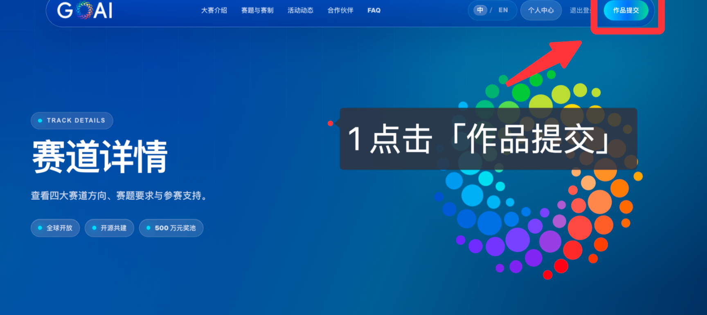

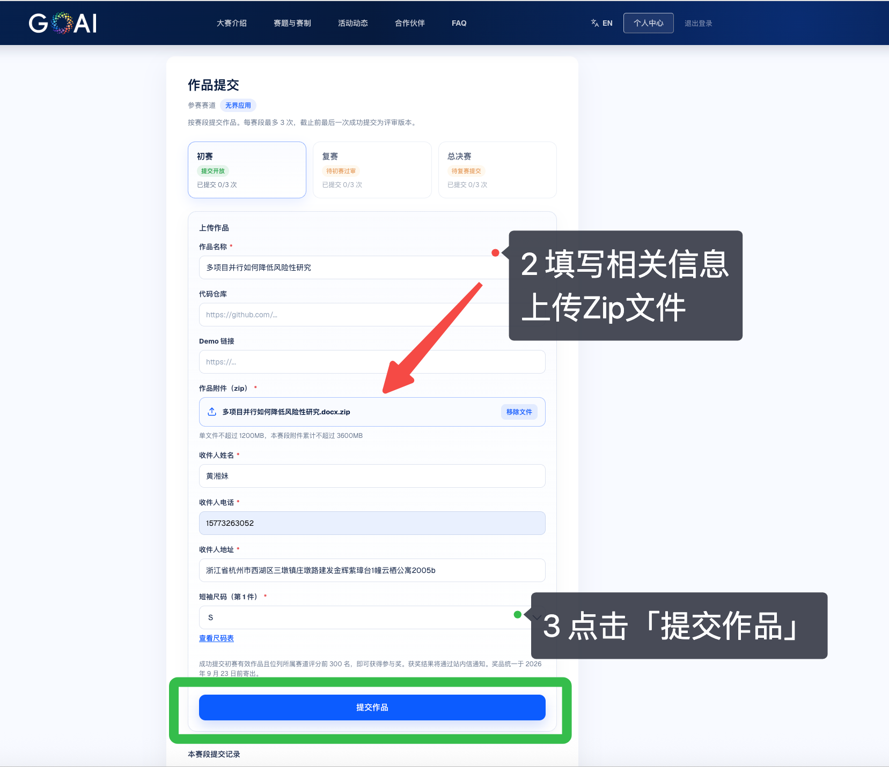

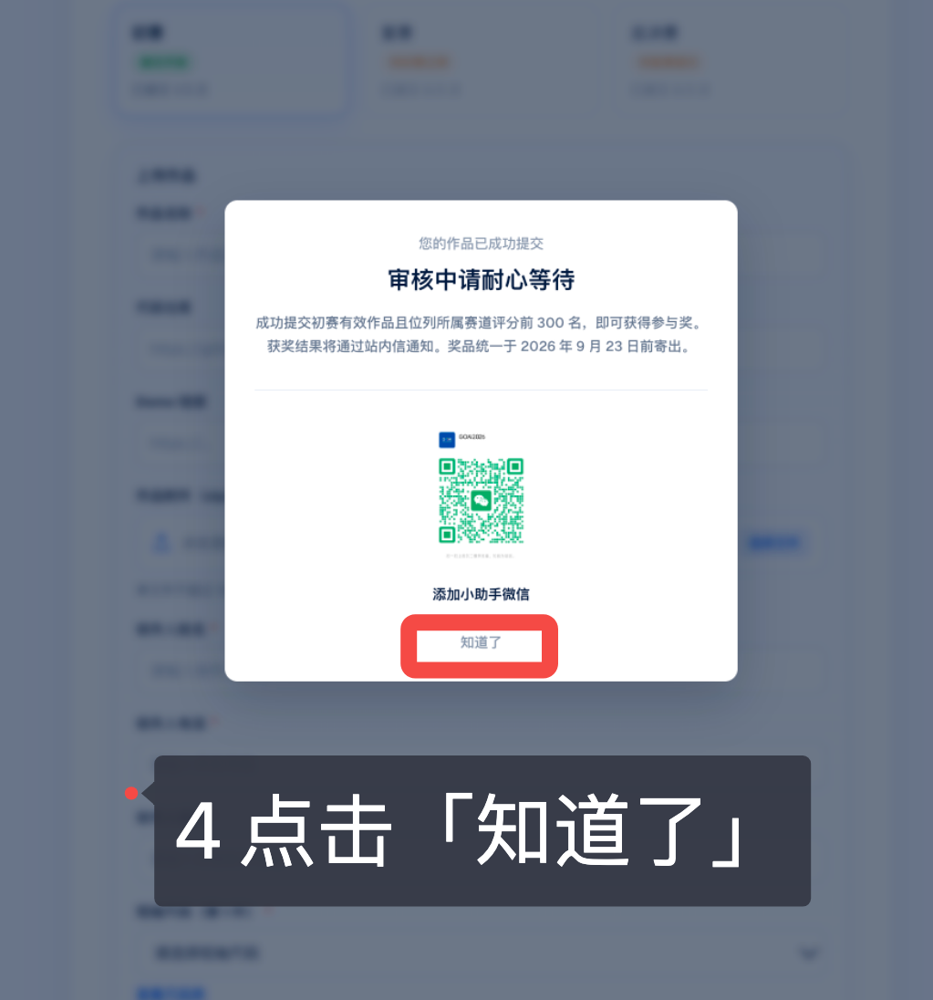

## 二、失败了怎么办？

若 Manager（用于创建 4 个 Agent 和 1 个 Team 的房间）仍可正常使用，可直接将报错信息发送给它，通常能解决大部分 AgentTeams 问题。

若仍无法解决， **请保留报错信息并截图，发送至学习群联系助教处理** 。

## 三、想知道如何优化作品？查看赛题老师的赛题解读直播分享

[https://ailc.datawhale.cn/hall/group/100001088/task/100001275](https://ailc.datawhale.cn/hall/group/100001088/task/100001275)
